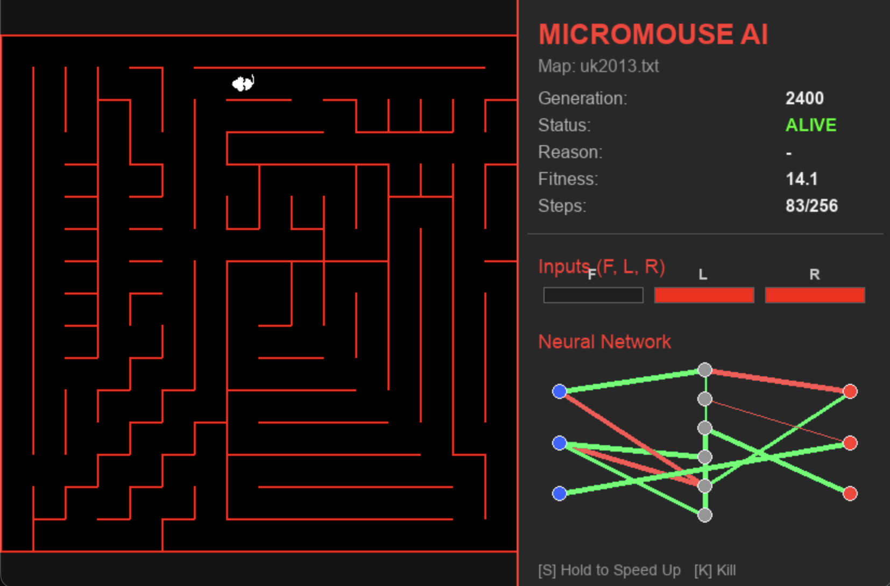

# Micromouse Neuroevolution
## Introduction
### What are Micromouse?

The Micromouse competition is an annual contest hosted by the Institute of
Electrical and Electronics Engineers (IEEE) where a small autonomous mobile robot, called a Micromouse, must navigate through an unknown maze and locate the center. The
Micromice are judged by the time it takes them to find the center. The robot that makes
the fastest timed run from the start to the center of the maze is declared the winner of
the competition.

The exit of the maze is positioned in the center of it, to avoid simple wall-following algorithms. They are also designed in such a way that the mouse can reach the destination through more than one path.

This project aims at training a neural network to solve these particular mazes.

### Elements

* `mouse.py`: a Class that models the micromouse and links it to a genome in a population; it takes care of the status, the movement and the fitness of the mouse.
* `maze.py`: a Class that models the maze as a list of integers using binary notation; takes care of the construction of a maze and its characteristics.
* `maze_loader.py`: a Class that loads the mazes from all the past competitions (and more) from a public Github repository.
* `direction.py`: n Enum used both by `mouse.py` and `maze.py` for navigating and building the maze.
* `evolution.py`: the file where the evolution of the NN using NEAT happens.
* `simulation.py`: the file to build a graphical interface to visualize the navigation of the mouse.

## Design

### Fitness
The fitness to evaluate a mouse is composed of 3 parts.
* **Distance score**: how near is (Manhattan distance) the last position of the mouse to the destination.
* **Novelty score**: how distant is the last position of the mouse with respect to the others; this was used in particular to allow for more exploration visiting the maze.
* **Cost**: a negative count based on wall collisions, being stuck and doing cycle paths.

### Inputs

There are 3 inputs and 3 outputs.
Inputs:
* how close is the wall ahead, with a sight of 3 blocks;
* how close is the wall on the left, with a sight of 1 block;
* how close is the wall on the right, with a sight of 1 block.

Outputs:
* go ahead;
* turn left;
* turn right.

At the beginning, there were 5 inputs, the x and the y coordinates of the mouse. However, this showed no improvements in their movement. I don't know if it was because the NN didn't understand how to use them or because of some ugly design choices and bugs I made at the beginning. I want to try to use them again to see if anything changed.

## Results

Despite the good intentions, and many headaches, the mice don't seem to be evolving. They evolve rapidly in the first 100 generations, learn to turn and move more smoothly in the maze. However, even after a couple of thousands of generation, 
they seem to be stuck at that certain fitness, with few mice that exceed it (probably by chance).

I believe this behaviour is due to the particular structure of the maze and to the fitness design. Since the destination is at the center of the maze, the mice that don't reach it have a high fitness if they end their simulation in a near by spot. So they learn to basically move and turn with a certain casuality. 
This explains they're inconsistance with different mazes.

I haven't been able to think about a fitness that could work better in this maze.

### Sources used

* For the novelty score: https://ceur-ws.org/Vol-3806/S_29_Omelianenko_Doroshenko_Rodin.pdf
* For a bit of inspiration with some choices: https://vbstudio.hu/en/blog/20190317-Growing-an-AI-with-NEAT
* Used LLMs for the graphical interface (completly); for the rest, just as helpers with decisions (not very effective) and for code support (not very effective).