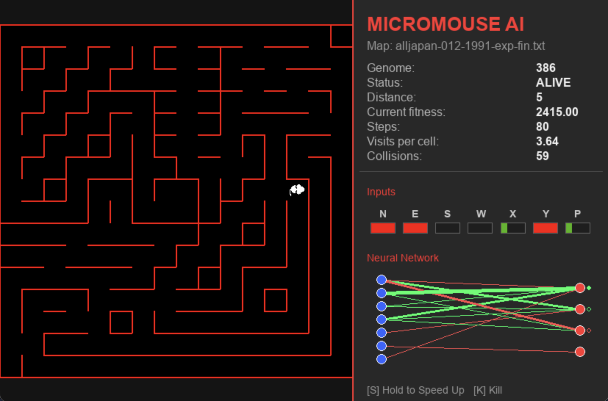

# Micromouse Neuroevolution
## Introduction
### What are Micromouse?

The Micromouse competition is an annual contest hosted by the Institute of
Electrical and Electronics Engineers (IEEE) where a small autonomous mobile robot, called a Micromouse, must navigate through an unknown maze and locate the center. The
Micromice are judged by the time it takes them to find the center. The robot that makes
the fastest timed run from the start to the center of the maze is declared the winner of
the competition.

The exit of the maze is positioned in the center of it, to avoid simple wall-following algorithms. They are also designed in such a way that the mouse can reach the destination through more than one path.

This project aims at training a neural network to solve these particular mazes.

### Elements

* `mouse.py`: Micromouse implementation, linked to a genome; it takes care of the status, the movement and the fitness
  of the mouse.
* `maze.py`: Maze representation as a list of integers using binary notation; takes care of the construction of a maze
  and its characteristics.
* `maze_loader.py`: Loads the mazes from all the past competitions (and more) from a public Github repository.
* `direction.py`: Direction abstraction, used in `mouse.py` and `maze.py` for navigating and building the maze.
* `evolution.py`: Main training script (NEAT population management).
* `simulation.py`: Visualization and simulation runner.

## Usage

### Dependencies

```
install neat-python pygame numpy requests tqdm
```

Training
Run the main training script to evolve a population of mice:

```
python evolution.py
```

Training parameters can be configured in main.py:

* NUM_GENERATIONS: Number of generations to train
* N_MAZES: Number of different mazes to evaluate each generation
* CHECKPOINT_INTERVAL: How often to save checkpoints and run simulations
* MAZE_LOAD_INTERVAL: How often to load new random mazes

## How It Works

### Neural Network Architecture

Each mouse has a neural network with:

**7 inputs:**

* 4 distance sensors (North, East, South, West)
* 2 relative position coordinates (X, Y)
* 1 proximity to goal value

**4 outputs:**

* Movement direction (North, East, South, West)

### Fitness Function

The fitness is updated during the exploration, rewarding the mouse for good behaviour.

Mice are rewarded for:

* Reaching the goal (+5000 points)
* Getting closer to the goal (+100 points)
* Exploring new cells (+100 points)

Mice are penalized for:

* Each step taken (-0.1 points)
* Colliding with walls (-2 points)
* Revisiting cells (-1 point)
* Exceeding maximum steps (-5 points)

## Results



Despite many headaches, the results are unfortunetly inconsistent. The mice seem to be upgrading slowly. They seem to
show better results when trained one maze at a time. But, they get stuck at a local optima, oscillating between two
positions while the fitness inevitably drops.

I believe this behaviour is due to the particular structure of the maze and to the fitness design.
Since the destination is at the center of the maze, if no mice reaches it, the ones with high fitness get stuck.
They learn to basically move and turn with a certain casuality, until hopefully one mouse reaches the goal.
Then, the path is well established and it doesn't get shorter (which was the point).

I tried many things, but haven't been able to think about a fitness that could work better in this maze.

### Use of AI

* Used LLMs help for the graphical interface (completly) and refactoring of the code; for the rest, just as helpers with
  decisions (not effective at all).